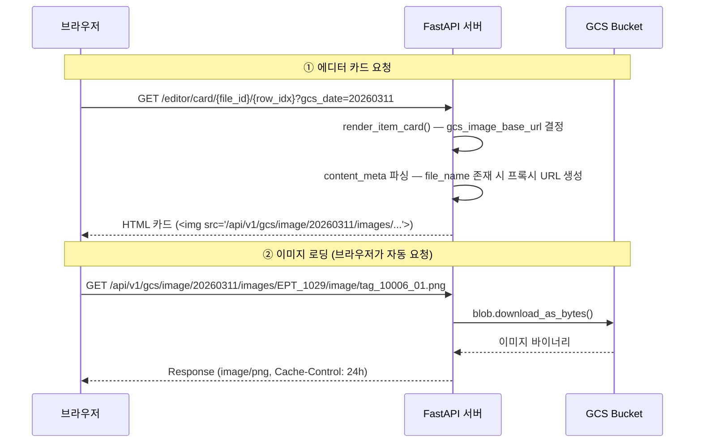
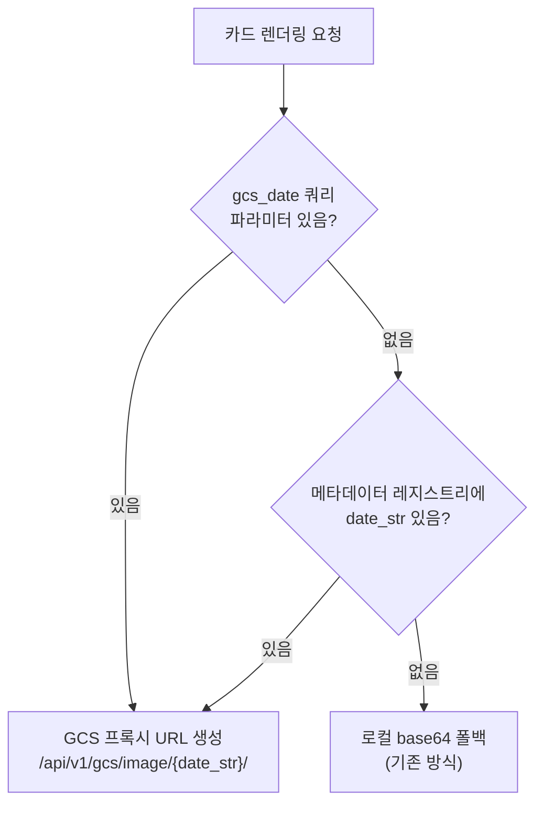
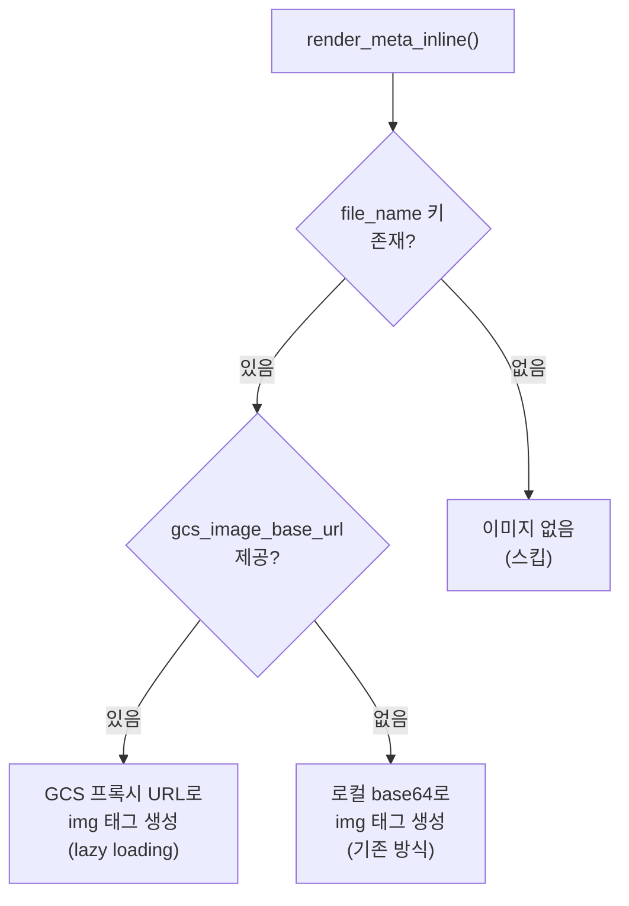
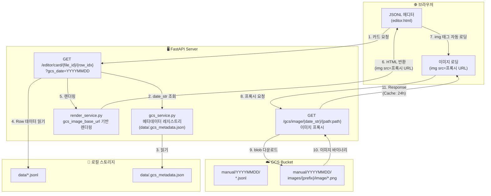
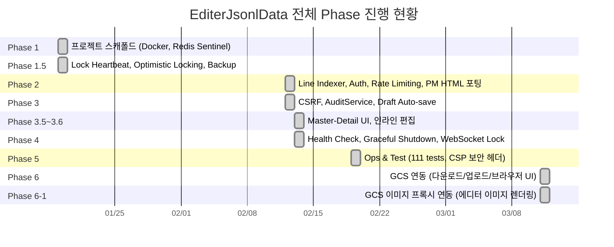

# Phase 6-1 — GCS 이미지 연동 개발 보고서

**작성일**: 2026-03-11  
**작성자**: AI Assistant + 사용자 협업  
**Phase**: 6-1  
**상태**: COMPLETED

---

## 1. 개요

Phase 6-1에서는 GCS에 저장된 JSONL 파일의 `content_meta` 내 이미지를 에디터에서 직접 렌더링하는 기능을 구현했다. 이미지를 로컬에 다운로드하지 않고, 서버가 GCS 프록시 역할을 하여 브라우저에 직접 서빙한다.

### 핵심 요구사항

| 항목 | 설명 |
|------|------|
| 이미지 소스 | GCS 버킷 내 `manual/{YYYYMMDD}/images/` 하위 |
| 이미지 참조 | JSONL `content_meta` 태그의 `file_name` 키 존재 시 |
| 렌더링 조건 | `type` 무관, `file_name` 키가 존재하면 이미지 렌더링 |
| 로컬 다운로드 | 불필요 — GCS에서 직접 서빙 |

### GCS 디렉터리 구조

```
gs://de-download-service-storage/manual/20260311/
├── EPT_1029_2019-4주완성독해력-5단계.jsonl
├── EPT_2001_수능완성.jsonl
└── images/
    ├── EPT_1029/
    │   └── image/
    │       ├── tag_10006_01.png
    │       ├── tag_10006_02.png
    │       └── ...
    └── EPT_2001/
        └── image/
            └── ...
```

### 이미지 경로 매핑

```
JSONL content_meta.tag_10006_01.file_name = "images/EPT_1029/image/tag_10006_01.png"
                                                ↓
GCS 전체 경로 = manual/{YYYYMMDD}/ + images/EPT_1029/image/tag_10006_01.png
                                                ↓
프록시 URL = /api/v1/gcs/image/{YYYYMMDD}/images/EPT_1029/image/tag_10006_01.png
```

---

## 2. 설계

### 2.1 이미지 서빙 전체 흐름



### 2.2 GCS 날짜(date_str) 결정 전략

에디터에서 이미지를 렌더링하려면 해당 파일이 어떤 GCS 날짜 폴더에 속하는지 알아야 한다. 3단계 폴백 전략을 사용한다.



### 2.3 메타데이터 레지스트리

GCS에서 파일을 다운로드할 때 `data/.gcs_metadata.json`에 파일별 GCS 출처 정보를 저장한다.

```json
{
  "EPT_1029_2019-4주완성독해력-5단계": {
    "date_str": "20260311",
    "gcs_path": "manual/20260311/EPT_1029_2019-4주완성독해력-5단계.jsonl",
    "downloaded_at": "2026-03-11T10:00:00+00:00"
  }
}
```

이를 통해 에디터에서 파일을 열 때 쿼리 파라미터 없이도 GCS 날짜를 자동으로 결정할 수 있다.

### 2.4 렌더링 분기 로직



---

## 3. 구현

### 3.1 GCS 이미지 프록시 엔드포인트 (`gcs.py`)

| Method | Path | Rate Limit | 설명 |
|--------|------|------------|------|
| `GET` | `/api/v1/gcs/image/{date_str}/{image_path:path}` | 300/분 | GCS 이미지 프록시 서빙 |

**특징:**
- `asyncio.to_thread()`로 GCS SDK 동기 I/O를 비차단 실행
- MIME 타입 자동 감지 (jpg, png, gif, bmp, webp, svg)
- `Cache-Control: public, max-age=86400` (24시간 브라우저 캐싱)
- 경로 순회 방지 (`..` 및 `/` 시작 차단, `Path(date_str).name` 정제)
- 이미지 미존재 시 404 반환

### 3.2 GCS 파일 메타데이터 레지스트리 (`gcs_service.py`)

| 메서드 | 설명 |
|--------|------|
| `save_file_metadata(file_id, date_str, gcs_path)` | GCS 다운로드 시 date_str 매핑 저장 |
| `get_file_metadata(file_id)` | 파일의 전체 GCS 메타데이터 조회 |
| `get_date_str_for_file(file_id)` | 파일에 연결된 날짜 문자열 반환 |

**저장 위치:** `data/.gcs_metadata.json`

### 3.3 렌더링 서비스 수정 (`render_service.py`)

`gcs_image_base_url: str | None = None` 파라미터를 전체 렌더링 체인에 추가:

```
render_item_card()
  └─ process_content_with_tags()
       └─ render_meta_inline()
            └─ _render_image_tag()    ← GCS URL / base64 분기
       └─ render_match_table()
       └─ render_bogi()
```

**GCS 모드 (`gcs_image_base_url` 존재):**
- `file_name`의 상대 경로를 그대로 사용: `{base_url}/{file_name}`
- `loading="lazy"` 속성으로 지연 로딩
- `onerror` 핸들러로 로드 실패 시 에러 메시지 표시

**로컬 모드 (`gcs_image_base_url` 없음):**
- 기존 `comparison` dict + base64 인코딩 방식 유지 (하위 호환)

### 3.4 에디터 카드 엔드포인트 수정 (`editor.py`)

`get_rendered_card`에 `gcs_date` 쿼리 파라미터 추가:

```
GET /api/v1/editor/card/{file_id}/{row_idx}?gcs_date=20260311
```

날짜 결정 우선순위:
1. 쿼리 파라미터 `gcs_date`
2. 메타데이터 레지스트리 (`gcs_service.get_date_str_for_file()`)
3. 없으면 로컬 base64 폴백

### 3.5 뷰 엔드포인트 수정 (`files.py`)

`view_file`에 `gcs_date` 쿼리 파라미터 전달:

```
GET /api/v1/view/files/{file_id}?gcs_date=20260311
```

동일한 3단계 폴백 전략으로 `gcs_date`를 결정하여 `editor.html` 템플릿에 전달.

### 3.6 프론트엔드 수정

#### `gcs_files.html`
- "편집" 링크에 `?gcs_date={date_str}` 쿼리 파라미터 추가
- GCS 파일 목록에서 편집 버튼 클릭 시 날짜 정보 자동 전달

#### `editor.html`
- `GCS_DATE` JavaScript 변수 추가 (서버에서 전달받은 `gcs_date`)
- 카드 AJAX 요청 시 `?gcs_date=` 쿼리 파라미터 포함

---

## 4. 데이터 흐름 전체 아키텍처



---

## 5. 변경/추가 파일 목록

### 수정 파일

| 파일 | 변경 내용 |
|------|-----------|
| `app/api/v1/endpoints/gcs.py` | 이미지 프록시 엔드포인트 추가, 다운로드 시 메타데이터 저장 로직 |
| `app/services/gcs_service.py` | 파일 메타데이터 레지스트리 (save/get/get_date_str) |
| `app/services/render_service.py` | `gcs_image_base_url` 파라미터를 6개 함수에 추가 |
| `app/api/v1/endpoints/editor.py` | `get_rendered_card`에 `gcs_date` 쿼리 파라미터 |
| `app/api/v1/endpoints/files.py` | `view_file`에 `gcs_date` 쿼리 파라미터 |
| `app/templates/gcs_files.html` | 편집 링크에 `?gcs_date=` 추가 |
| `app/templates/editor.html` | `GCS_DATE` JS 변수, 카드 fetch에 쿼리 파라미터 |

### 신규 파일

| 파일 | 역할 |
|------|------|
| `data/.gcs_metadata.json` | GCS 다운로드 파일별 메타데이터 (자동 생성) |

---

## 6. 설계 결정 사항

### 6.1 프록시 방식 vs Signed URL vs Public URL

| 방식 | 장점 | 단점 | 채택 |
|------|------|------|------|
| **서버 프록시** | ADC만으로 동작, 별도 키 불필요, 접근 제어 용이 | 서버 대역폭 사용 | ✅ |
| Signed URL | 클라이언트 직접 접근, 서버 부하 감소 | 서비스 계정 키 필요, URL 만료 관리 | — |
| Public URL | 가장 단순 | 보안 취약, 버킷 전체 공개 필요 | — |

### 6.2 캐싱 전략

- `Cache-Control: public, max-age=86400` (24시간)
- 이미지 원본이 변경되는 경우는 드물므로 충분한 TTL
- 향후 CDN 연동 시 별도 캐싱 레이어 추가 가능

### 6.3 하위 호환성

- `gcs_image_base_url=None` (기본값)이면 기존 로컬 base64 방식 유지
- Phase 6 이전의 로컬 이미지 기반 워크플로우에 영향 없음
- GCS 연결 없이도 에디터 기본 기능 정상 동작

---

## 7. 전체 Phase 진행 현황


