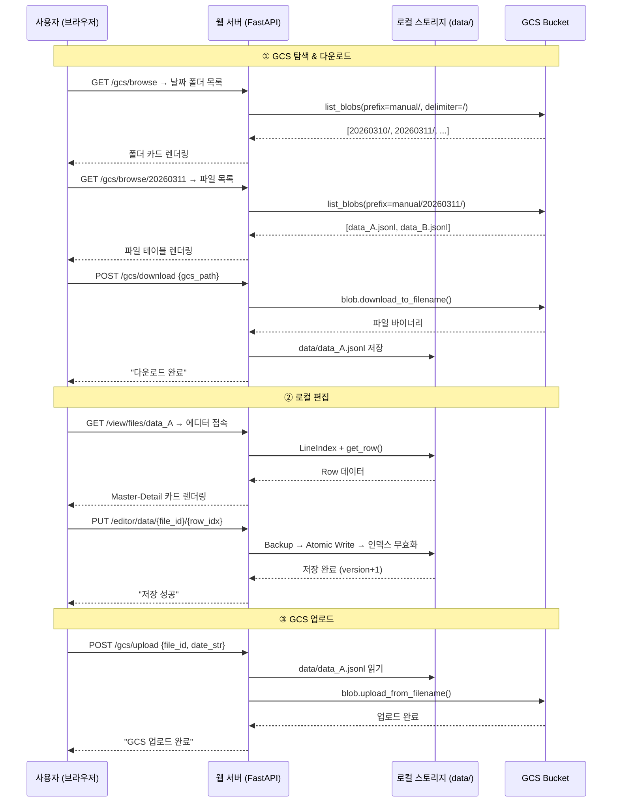
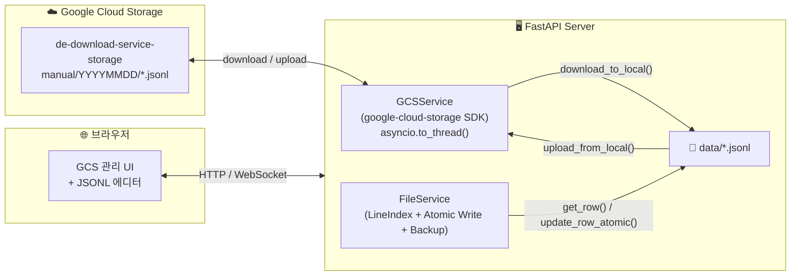
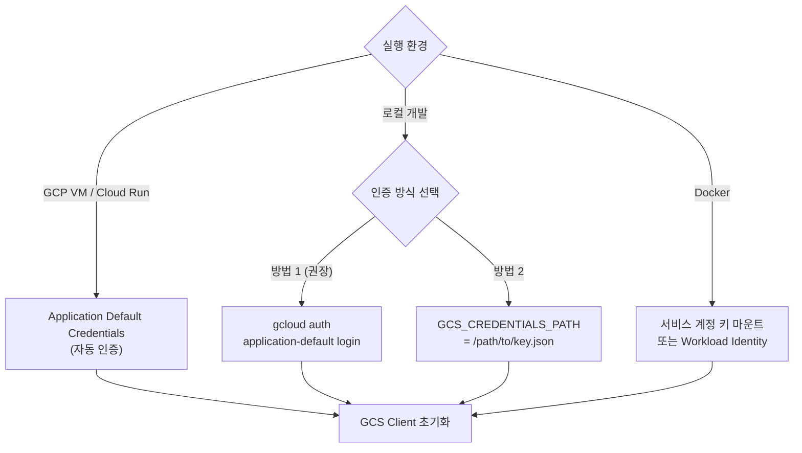
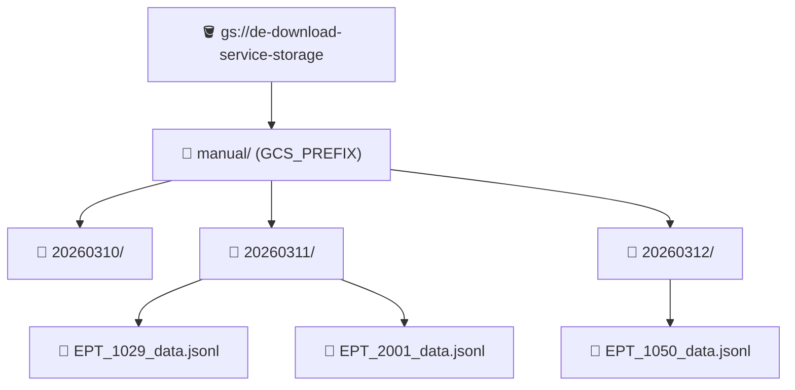
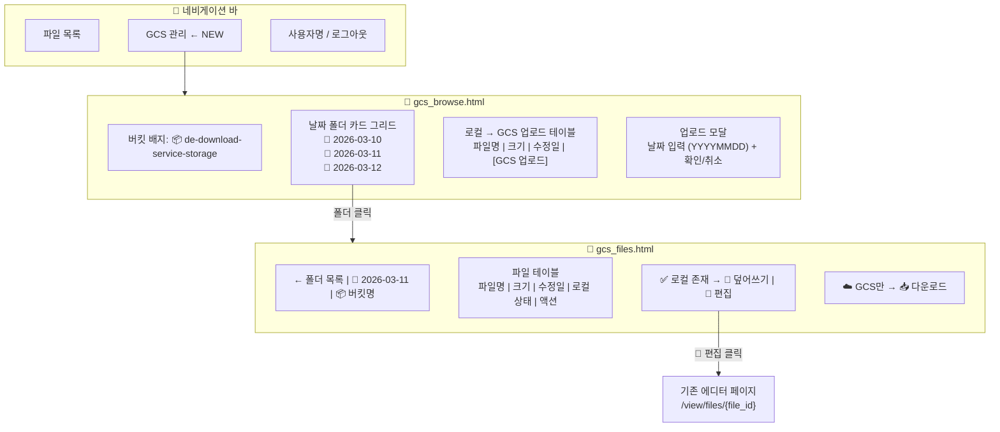
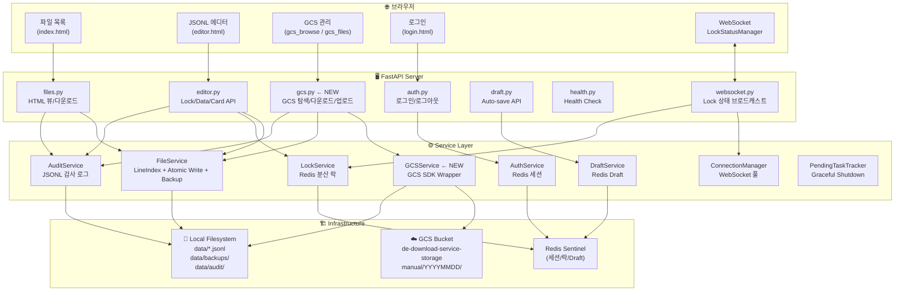
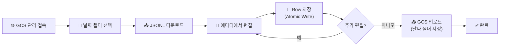
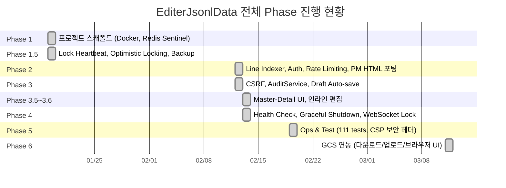

# Phase 6 — GCS 연동 개발 보고서

**작성일**: 2026-03-11  
**작성자**: AI Assistant + 사용자 협업  
**Phase**: 6  
**상태**: COMPLETED

---

## 1. 개요

Phase 6에서는 Google Cloud Storage(GCS) 연동을 구현하여, GCS 버킷에 업로드된 JSONL 파일을 웹 에디터에서 탐색·다운로드·편집·재업로드할 수 있는 워크플로우를 완성했다.

### GCS 구성 정보

| 항목 | 값 |
|------|-----|
| 프로젝트 | `crowdworks-platform` |
| 리전 | `asia-northeast1` |
| 버킷 | `de-download-service-storage` |
| 경로 패턴 | `manual/YYYYMMDD/filename.jsonl` |

### 전체 워크플로우



---

## 2. 설계

### 2.1 GCSService 아키텍처

GCS SDK(`google-cloud-storage`)의 동기 API를 `asyncio.to_thread()`로 래핑하여 비동기 서비스로 구현했다. 기존 FileService(LineIndex, Atomic Write, Backup)는 그대로 유지하고, GCS는 파일의 원본 저장소/최종 배포처로만 활용한다.



### 2.2 인증 전략



### 2.3 GCS 경로 구조



---

## 3. 구현

### 3.1 GCSService (`app/services/gcs_service.py`)

| 메서드 | 설명 |
|--------|------|
| `list_date_folders()` | `manual/` 하위 날짜 폴더(YYYYMMDD) 목록 조회 |
| `list_files(date_str)` | 특정 날짜 폴더 내 JSONL 파일 목록 |
| `download_to_local(gcs_path, overwrite)` | GCS → 로컬 `data/` 다운로드 |
| `upload_from_local(file_id, date_str)` | 로컬 → GCS 업로드 (날짜 폴더 지정) |
| `blob_exists(gcs_path)` | GCS blob 존재 여부 확인 |
| `get_blob_metadata(gcs_path)` | GCS blob 메타데이터 조회 |
| `check_connection()` | GCS 연결 상태 확인 |

**설계 결정:**
- `asyncio.to_thread()` 사용: GCS SDK의 동기 I/O를 이벤트 루프 블로킹 없이 실행
- Lazy initialization: `client`/`bucket` 프로퍼티로 첫 접근 시에만 초기화
- 경로 안전성: `Path(file_id).name`으로 디렉터리 순회 방지

### 3.2 GCS 다운로드/업로드 플로우

```mermaid
flowchart TD
    subgraph DOWNLOAD ["📥 GCS → 로컬 다운로드"]
        D1["POST /gcs/download<br/>{gcs_path, overwrite}"]
        D2{"로컬 파일<br/>이미 존재?"}
        D3{"overwrite<br/>= true?"}
        D4["GCS blob.download_to_filename()"]
        D5["FileService._invalidate_index()"]
        D6["AuditService.log(gcs_download)"]
        D7["✅ 다운로드 완료"]
        D8["ℹ️ 이미 존재 (스킵)"]

        D1 --> D2
        D2 -->|"예"| D3
        D2 -->|"아니오"| D4
        D3 -->|"true"| D4
        D3 -->|"false"| D8
        D4 --> D5 --> D6 --> D7
    end

    subgraph UPLOAD ["📤 로컬 → GCS 업로드"]
        U1["POST /gcs/upload<br/>{file_id, date_str}"]
        U2{"로컬 파일<br/>존재?"}
        U3{"date_str<br/>지정?"}
        U4["오늘 날짜<br/>YYYYMMDD 사용"]
        U5["GCS blob.upload_from_filename()<br/>→ manual/{date_str}/{file_id}.jsonl"]
        U6["AuditService.log(gcs_upload)"]
        U7["✅ 업로드 완료"]
        U8["❌ 404 File Not Found"]

        U1 --> U2
        U2 -->|"예"| U3
        U2 -->|"아니오"| U8
        U3 -->|"빈 문자열"| U4 --> U5
        U3 -->|"지정됨"| U5
        U5 --> U6 --> U7
    end
```



### 3.3 GCS API 엔드포인트 (`app/api/v1/endpoints/gcs.py`)

#### HTML 뷰

| Method | Path | 설명 |
|--------|------|------|
| `GET` | `/api/v1/gcs/browse` | GCS 날짜 폴더 브라우저 |
| `GET` | `/api/v1/gcs/browse/{date_str}` | 특정 날짜 파일 목록 |

#### JSON API

| Method | Path | CSRF | Rate Limit | 설명 |
|--------|------|------|------------|------|
| `GET` | `/api/v1/gcs/folders` | X | 60/분 | 날짜 폴더 목록 |
| `GET` | `/api/v1/gcs/files/{date_str}` | X | 60/분 | 파일 목록 |
| `POST` | `/api/v1/gcs/download` | O | 30/분 | GCS → 로컬 다운로드 |
| `POST` | `/api/v1/gcs/upload` | O | 10/분 | 로컬 → GCS 업로드 |
| `GET` | `/api/v1/gcs/status` | X | — | GCS 연결 상태 |

### 3.4 GCS 관리 UI

#### 폴더 브라우저 (`gcs_browse.html`)
- 날짜별 폴더 카드 그리드 (최신순 정렬)
- 로컬 파일 → GCS 업로드 테이블 (날짜 입력 모달)
- GCS 연결 오류 시 알림 배너

#### 파일 목록 (`gcs_files.html`)
- 파일 테이블: 이름, 크기, 수정일, 로컬 상태 배지
- 로컬 미존재: "📥 다운로드" 버튼
- 로컬 존재: "🔄 덮어쓰기" + "📝 편집" 버튼
- 다운로드 완료 시 자동 새로고침

### 3.5 UI 화면 구성



### 3.6 설정 (`app/core/config.py`)

| 설정 | 기본값 | 설명 |
|------|--------|------|
| `GCS_PROJECT_ID` | `crowdworks-platform` | GCP 프로젝트 ID |
| `GCS_BUCKET_NAME` | `de-download-service-storage` | GCS 버킷명 |
| `GCS_PREFIX` | `manual` | 버킷 내 기본 prefix |
| `GCS_LOCATION` | `asia-northeast1` | 리전 |
| `GCS_CREDENTIALS_PATH` | `""` (빈 문자열=ADC) | 서비스 계정 키 파일 경로 |

---

## 4. 전체 시스템 아키텍처 (Phase 6 반영)



---

## 5. 변경/추가 파일 목록

### 신규 파일

| 파일 | 역할 |
|------|------|
| `app/services/gcs_service.py` | GCS 파일 관리 서비스 |
| `app/api/v1/endpoints/gcs.py` | GCS API 엔드포인트 (HTML 뷰 + JSON API) |
| `app/templates/gcs_browse.html` | GCS 폴더 브라우저 + 업로드 UI |
| `app/templates/gcs_files.html` | GCS 파일 목록 + 다운로드/편집 UI |

### 수정 파일

| 파일 | 변경 내용 |
|------|-----------|
| `app/core/config.py` | GCS 설정 5항목 추가 |
| `app/api/v1/api.py` | GCS 라우터 등록 (`/gcs` prefix) |
| `app/services/audit_service.py` | `gcs_download`, `gcs_upload` ActionType 추가 |
| `app/templates/base.html` | 네비게이션에 "GCS 관리" 메뉴 추가 |
| `pyproject.toml` | `google-cloud-storage>=2.14.0` 의존성 추가 |
| `.env` | GCS 환경변수 5항목 추가 |
| `.env.example` | GCS 환경변수 5항목 추가 |

---

## 6. 사용 가이드

### 6.1 GCS 인증 설정 (로컬 개발)

```bash
# 방법 1: gcloud CLI 인증 (권장)
gcloud auth application-default login

# 방법 2: 서비스 계정 키 파일
export GCS_CREDENTIALS_PATH=/path/to/service-account-key.json
```

### 6.2 사용자 워크플로우



### 6.3 URL 구조

```
# GCS 관리 (HTML)
GET  /api/v1/gcs/browse                → 날짜 폴더 브라우저
GET  /api/v1/gcs/browse/{YYYYMMDD}     → 특정 날짜 파일 목록

# GCS JSON API
GET  /api/v1/gcs/folders               → 폴더 목록 (JSON)
GET  /api/v1/gcs/files/{YYYYMMDD}      → 파일 목록 (JSON)
POST /api/v1/gcs/download              → GCS → 로컬 다운로드
POST /api/v1/gcs/upload                → 로컬 → GCS 업로드
GET  /api/v1/gcs/status                → 연결 상태 확인
```

---

## 7. 전체 진행 현황


